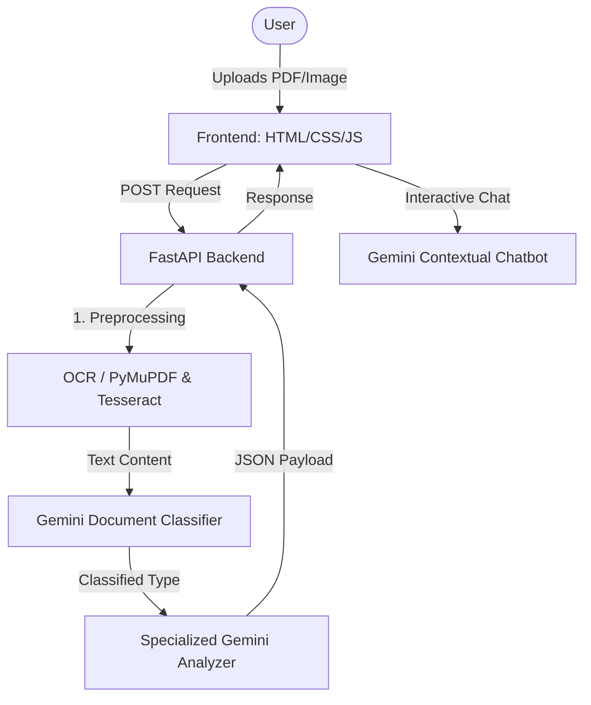

# MediVision 🩺✨

MediVision is a premium, AI-powered Medical Report & Diagnostic Scan Analyzer. It simplifies complex medical reports (PDFs, blood tests, prescriptions) and imaging scans (X-rays, MRIs, CT scans) into easy-to-understand clinical summaries, diet/exercise recommendations, lifestyle routines, and medicine instructions. It also features a context-aware interactive medical chatbot that communicates in English or Hinglish.

---

## 🚀 Key Features

* **Intelligent Document Intake**: Supports PDF, PNG, JPG, JPEG, and AVIF file uploads.
* **Hybrid OCR System**: Extracts text using PyMuPDF (`fitz`) and Tesseract OCR with PIL image preprocessing (grayscale, contrast enhancement, sharpening, and binarization). Uses Google Gemini Multimodal OCR as a fallback.
* **Auto-Classification**: Automatically classifies documents into **Lab Reports**, **Prescriptions**, **X-rays/Scans**, or **General Medical Documents** to apply specialized clinical analysis prompts.
* **Smart Radiographical Diagnosis**: Processes diagnostic scans and X-rays using Google Gemini's vision models.
* **Contextual Medical Chatbot**: An empathetic chatbot initialized with the context of your uploaded health document for follow-up questions.
* **Bilingual Support (English & Hindi)**: Dynamic translation toggling of analysis cards with smooth micro-animations.
* **Rich Animated UI**: Dark-mode glassmorphic interface with canvas-based background animation featuring floating particles and scrolling ECG waveforms.

---

## 🏗️ Architecture & Tech Stack

MediVision is built with a decoupled client-server architecture:



### Frontend
* **Core**: HTML5, Vanilla JavaScript.
* **Styling**: Vanilla CSS3 using custom HSL color systems, glassmorphism design, CSS variables, and keyframe animations.
* **Animations**: Canvas-based custom medical molecular telemetry grid and dual-layer sinus ECG waves.

### Backend
* **Web Framework**: FastAPI (Python) for asynchronous endpoints.
* **Document Processing & OCR**:
  * `PyMuPDF` (fitz) for reading digital PDF text.
  * `pytesseract` (Tesseract-OCR) for optical character recognition on scanned pages.
  * `Pillow` (PIL) and `pillow-avif-plugin` for advanced image scaling, contrast adjustment, sharpening, and binarization.
* **AI Engine**: Google Gemini API (`gemini-pro`, `gemini-3.1-flash-lite`) accessed via REST requests for text categorization, structured clinical analysis, and chat.

---

## 🔍 Detailed System Workflow

### Step 1: File Intake & Validation
The frontend validates file extensions (`.pdf`, `.png`, `.jpg`, `.jpeg`, `.avif`). If valid, the user starts the analysis.

### Step 2: Advanced OCR & Text Extraction
1. **PDF Files**: The backend reads pages using `PyMuPDF`. If the extracted text is too short (< 50 chars), it renders the PDF pages as high-resolution images (2x zoom) and falls back to OCR.
2. **Image Files**: Images are enhanced using PIL:
   * Conversion to Grayscale.
   * Upscaling for higher detail.
   * Autocontrast normalization.
   * Unsharp mask filtering.
   * Dynamic threshold binarization.
3. **Gemini Multimodal OCR Fallback**: If Tesseract is unavailable or fails, the image is base64 encoded and sent to Gemini with a specialized OCR extraction prompt.

### Step 3: Document Classification
The extracted text and raw images are analyzed by Gemini to decide the document type. The system routes the content into one of four tailored processing pipelines:
* **Lab Report**: Extracts medical parameters, findings, diet, exercise, medicines, and lifestyle pointers.
* **Prescription**: Focuses strictly on medicine name, dosage, frequency, safety precautions, and instructions.
* **X-ray / Scan**: Uses Gemini Vision to analyze structure, findings, anomalies, and recommendations.
* **General Medical Document**: Generates administrative and general health summaries.

### Step 4: UI Rendering & Translation
The frontend parses the JSON response and updates the UI cards. The user can toggle translation, which requests translation of the analysis JSON to Hindi via Gemini, cacheing the result for performance.

### Step 5: Advisory Chat Stream
The chatbot uses session memory to allow users to ask questions. Every message is accompanied by the report context to prevent hallucinations.

---

## 🛠️ Local Setup Instructions

### Prerequisites
* Python 3.9 or higher
* [Tesseract OCR installed locally](https://github.com/UB-Mannheim/tesseract/wiki) (Default expected path: `C:\Program Files\Tesseract-OCR\tesseract.exe`)

### 1. Clone & Navigate to Project
```bash
git clone https://github.com/Adarshtiwari44/MediVision.git
cd MediVision
```

### 2. Configure Environment Variables
Create a `.env` file in the root directory:
```env
GEMINI_API_KEY=your_gemini_api_key_here
GEMINI_MODEL=gemini-3.1-flash-lite
```

### 3. Setup Virtual Environment & Install Dependencies
```powershell
# Create venv
python -m venv venv

# Activate venv
.\venv\Scripts\activate

# Install requirements
pip install -r requirements.txt
```

### 4. Run Backend Server
```powershell
python -m uvicorn backend.main:app --reload --port 8000
```

### 5. Run Frontend Server
In a new terminal window:
```powershell
python -m http.server 5500
```
Open `http://localhost:5500/Frontend` in your web browser.

---

## 🩺 Clinical Disclaimer
*MediVision is an AI-assisted analysis tool designed for informational and educational purposes only. It does not provide medical diagnoses or treatment advice. Always consult a certified healthcare professional before making clinical decisions.*
