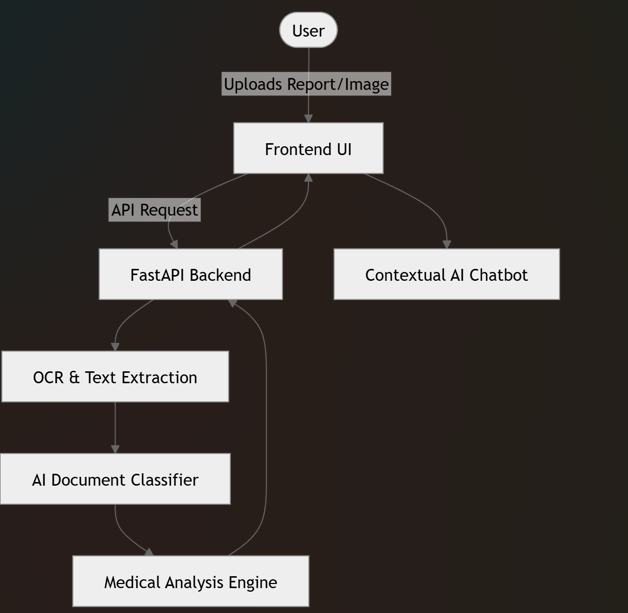

MediVision 🩺✨
AI-Powered Medical Report & Diagnostic Scan Analyzer

🌟 Overview

MediVision is an advanced AI-driven healthcare platform designed to simplify medical reports and diagnostic scans into clear, human-friendly insights. It helps users understand complicated medical information such as blood test reports, prescriptions, X-rays, MRI scans, and CT scans without requiring deep medical knowledge.

The platform combines Artificial Intelligence, OCR technology, and modern web development to provide accurate summaries, health recommendations, medicine guidance, and interactive medical assistance in both English and Hinglish.

Unlike traditional report analyzers, MediVision focuses on delivering an intuitive and engaging experience through a visually rich interface and a context-aware chatbot.

🚀 Core Features
📄 Smart Medical Document Upload

MediVision supports multiple medical document formats, including:

PDF Reports
PNG Images
JPG / JPEG Images
AVIF Files

Users can simply upload their medical documents, and the system automatically begins processing them.

🔍 Advanced OCR & Text Extraction

The platform uses a hybrid OCR pipeline to extract text from both digital and scanned reports.

Technologies Used:
PyMuPDF (fitz) → Reads digital PDFs directly.
Tesseract OCR → Extracts text from scanned documents.
PIL (Python Imaging Library) → Enhances image quality before OCR.
Image Enhancement Techniques:
Grayscale conversion
Contrast enhancement
Image sharpening
Upscaling
Binarization for clearer text recognition

If local OCR fails, MediVision automatically switches to Google Gemini Multimodal OCR as a fallback mechanism.

🧠 Intelligent Document Classification

Once the text is extracted, the system automatically classifies the document into specific medical categories such as:

Lab Reports
Prescriptions
X-rays / Scans
General Medical Documents

This classification allows the AI model to generate more specialized and accurate analysis results.

🩻 AI-Based Scan & X-ray Analysis

MediVision can analyze radiology images using Google Gemini Vision models.

The system can:

Detect abnormalities
Summarize scan findings
Explain observations in simple language
Provide lifestyle and health suggestions

This makes complex medical imaging easier for normal users to understand.

💬 Context-Aware Medical Chatbot

The integrated chatbot understands the uploaded report context and allows users to ask follow-up questions naturally.

Example:

Users can ask:

“What does my cholesterol level mean?”
“Is this medicine safe?”
“What foods should I avoid?”

The chatbot responds based on the uploaded medical report, reducing irrelevant or hallucinated answers.

🌐 Bilingual Support

MediVision supports:

English
Hindi / Hinglish

Users can instantly translate medical summaries using smooth animated UI transitions, making healthcare information accessible to a wider audience.

🎨 Modern User Interface

The frontend is designed using a premium glassmorphism-inspired dark theme with animated medical visuals.

UI Highlights:
Floating particles animation
ECG waveform effects
Smooth transitions
Interactive cards
Responsive design

The interface is clean, modern, and optimized for user engagement.

🏗️ System Architecture

MediVision follows a client-server architecture where the frontend and backend work independently.

💻 Technology Stack
Frontend
HTML5
CSS3
Vanilla JavaScript
Design Features
Glassmorphism UI
HSL-based color system
CSS animations
Canvas-based medical effects
Backend
FastAPI (Python)
OCR & Processing
PyMuPDF
pytesseract
Pillow (PIL)
pillow-avif-plugin
AI Integration
Google Gemini API
Gemini Vision Models
⚙️ Detailed Workflow
Step 1: File Validation

The frontend first validates the uploaded file type to ensure compatibility.

Step 2: OCR & Image Processing
For PDFs:
Extract text directly using PyMuPDF.
If insufficient text is detected, pages are converted into high-resolution images for OCR.
For Images:

The system enhances images using:

Grayscale conversion
Sharpening
Contrast normalization
Threshold binarization
Step 3: AI Classification

The extracted content is sent to Gemini AI for classification into the appropriate medical category.

Step 4: Specialized Medical Analysis

Based on document type, different AI prompts are used:

Lab Reports
Health parameter analysis
Diet suggestions
Lifestyle recommendations
Prescriptions
Medicine details
Dosage instructions
Safety precautions
X-rays & Scans
Structural observations
Abnormality detection
Recommendations
Step 5: Frontend Rendering

The backend sends structured JSON responses which are rendered into dynamic UI cards.

Step 6: AI Chat Assistance

Users can continue interacting with the chatbot for personalized explanations and medical guidance.

🛠️ Installation & Setup
Prerequisites

Before running the project, install:

Python 3.9+
Tesseract OCR
Clone the Repository
git clone https://github.com/Adarshtiwari44/MediVision.git
cd MediVision
Configure Environment Variables

Create a .env file:

GEMINI_API_KEY=your_api_key
GEMINI_MODEL=gemini-3.1-flash-lite
Create Virtual Environment
python -m venv venv
Activate Environment
.\venv\Scripts\activate
Install Dependencies
pip install -r requirements.txt
Run Backend Server
python -m uvicorn backend.main:app --reload --port 8000
Run Frontend

Open another terminal and run:

python -m http.server 5500

Then visit:

http://localhost:5500/Frontend
⚠️ Medical Disclaimer

MediVision is an AI-assisted healthcare support tool developed for educational and informational purposes only.

It does not replace professional medical advice, diagnosis, or treatment. Users should always consult certified healthcare professionals before making medical decisions.

🎯 Conclusion

MediVision demonstrates how modern AI technologies can simplify healthcare accessibility by transforming difficult medical data into understandable insights.

By combining:

OCR,
Artificial Intelligence,
Medical image analysis,
Context-aware chat systems,
and a modern interactive UI,

the platform creates a smarter and more user-friendly healthcare experience for everyone.